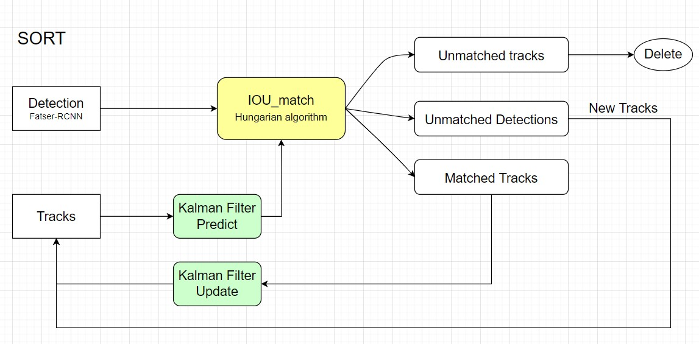
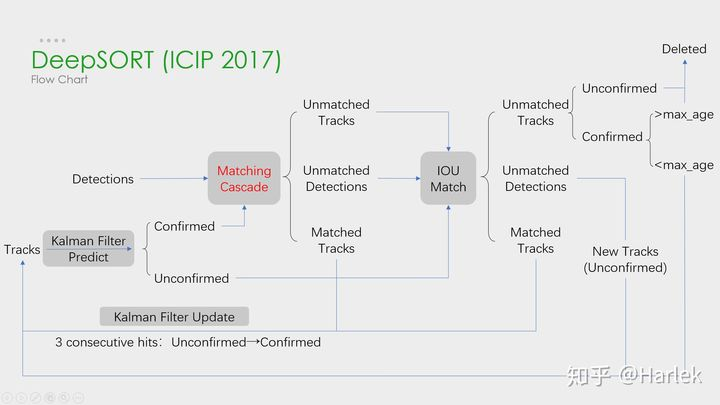

# MOT(Multiple Object Tracking) Survey

> [多目标跟踪博客](https://zhuanlan.zhihu.com/p/388721763)
> [MOT 入门博客](https://zhuanlan.zhihu.com/p/97449724)
>
> [Paper with Code](https://paperswithcode.com/task/multi-object-tracking/latest)
> Kaggle 实战 [NFL Helmet Tracking](http://mp.weixin.qq.com/s?__biz=Mzk0NDE5Nzg1Ng==&mid=2247505861&idx=1&sn=825d484da746cf191eb34be90d521389&chksm=c32ace4af45d475cafa77912273e2a825a8e8c79fcb521f4775299ef1bfc3c3c927f4a99d2cf&mpshare=1&scene=24&srcid=12070YPIGhENos8j0SlStGiQ&sharer_sharetime=1670376290126&sharer_shareid=80378081a7efb99c3e6058ae578c9bcd#rd)
> [pedestrian_track_YoloV5_repo](https://github.com/dyh/unbox_yolov5_deepsort_counting)
> [track with cannonical methods](https://github.com/srianant/kalman_filter_multi_object_tracking)

## overview 

多目标跟踪，一般简称为 MOT(Multiple Object Tracking)，也有一些文献称作 MTT(Multiple Target Tracking)。**在事先不知道目标数量的情况下，对视频中的行人、汽车、动物等多个目标进行检测并赋予ID进行轨迹跟踪。**不同的目标拥有不同的 ID，以便实现后续的轨迹预测、精准查找等工作。

- MOT算法的通常工作流程 :star:
  1. 给定视频的原始帧，进行**目标检测**：运行对象检测器以获得对象的边界框
  2. 对于每个检测到的物体，**计算出不同的特征**，通常是视觉和运动特征
  3. **相似度计算**计算两个对象属于同一目标的概率
  4. **数据关联**，为每个对象分配数字ID。

- MOT 存在的问题

  多目标跟踪中即要面对在**单目标跟踪中存在的遮挡、变形**、运动模糊、拥挤场景、快速运动、光照变化、尺度变化等挑战，还要面对如**轨迹的初始化与终止**、**相似目标间的相互干扰**等复杂问题。

### general survey

- [2019_survey_Deep-Learning-in-Video-Multi-Object-Tracking-A-Survey.pdf](./docs/2019_survey_Deep-Learning-in-Video-Multi-Object-Tracking-A-Survey.pdf)

### embedding learning in MOT

[2022_survey_Recent-Advances-in-Embedding-Methods-for-Multi-Object-Tracking-A-Survey.pdf](./docs/2022_survey_Recent-Advances-in-Embedding-Methods-for-Multi-Object-Tracking-A-Survey.pdf)

> mainly focus on embedding learning in MOT.

The flow of `embedding learning in MOT system` are divided into 2 parts: `embedding module` and `association module`. Input with multi successive frames to predict the location and track identities(IDs).

### related Tasks

> 1. SOT(Single-object Tracking, also known as VOT[Visual object Tracking])
> 2. VOD(Video object detection)
> 3. re-identification(Re-ID)

**SOT 单目标跟踪**

SOT aims to estimate an unknown visual target trajectory when o**nly an initial state of the target (in a video frame) is available** 第一帧给定 bounding box 并进行跟踪

**Unlike SOT, initial states of objects are unknown in the MOT task**, requiring pre-defined categories for tracking

## Dataset

- **MOTChallenge**

  行人追踪数据集，最常用的数据集

- [SportsMOT](https://paperswithcode.com/paper/sportsmot-a-large-multi-object-tracking)

- DanceTrack

- 车辆轨迹数据集 [集合博客](https://zhuanlan.zhihu.com/p/491056675)

- [Ubiquitous Traffic Eyes](http://seutraffic.com/#/download) 

  有视频 & 轨迹 & 时刻速度 :star:

- [UA-DETRAC dataset](https://detrac-db.rit.albany.edu/)

  [YoloV5 train for car detection](https://blog.csdn.net/guyuealian/article/details/128099672)

## metrics

- Classicial Metrics

  - FP：False Positive，即真实情况中没有，但跟踪算法误检出有目标存在。
  - FN：False Negative，即真实情况中有，但跟踪算法漏检了。
  - IDS：ID Switch，目标ID切换的次数。
  - Frag

- CLEAR MOT metrics
  06 年提出的 CLEAR MOT **更多衡量的是检测的质量，而不是跟踪的效果**

  - MOTA(Multiple Object Tracking Accuracy) 多目标跟踪准确度 :star:
    **可以较好地反映跟踪准确度，是当前 MOT 的主要评估指标**。但 MOTA 不能反映 MOT 算法对同一个目标轨迹长时间跟踪性能表现。
  - MOTP：Multiple Object Tracking Precision，多目标跟踪精度。表示得到的检测框和真实标注框之间的重合程度。

- ID scores(identification scores) 
  基于匹配的指标，所以能更好**的衡量数据关联的好坏**

  - IDP(identification  precision), IDR(Recall)

  - ID F1，正确身份标签赋予的检测框与平均ground truth和计算的检测数量的比值。
    $$
    IDP = \frac{IDTP}{IDTP + IDFP}\\
    IDR = \frac{IDTP}{IDTP + IDFN} \\
    IDF1= \frac{2}{1/IDP + 1/IDR}
    $$
    

- MT(Most Tracked)，ML(Mostly Lost)

  衡量追踪效果

  - MT：Mostly Tracked，大多数目标被跟踪的轨迹数量。目标被成功跟踪到的轨迹长度与轨迹总长度的比值大于等于80%的轨迹数量。
  - ML：Mostly Lost，大多数目标被跟丢的轨迹数量。目标被成功跟踪到的轨迹长度与轨迹总长度的比值小于等于20%的轨迹数量。

- FPS：Frames Per Second，每秒处理的帧数

## Detection-based-Tracking

> 初步理解，需要达到的要求：读完至少知道这两篇论文各哪有几个小节（精确到二级标题），主要部件是哪些。

先对视频序列的每一帧进行目标检测，根据包围框对目标进行裁剪，得到图像中的所有目标。然后，转化为前后两帧之间的目标关联问题，通过IoU、外观等构建相似度矩阵，并通过匈牙利算法、贪婪算法等方法进行求解。

### YoloV5

> [博客参考](https://blog.csdn.net/WZZ18191171661/article/details/113789486)

### SORT

> [博客参考](https://zhuanlan.zhihu.com/p/196622890)
> [2017_SORT_SIMPLE-ONLINE-AND-REALTIME-TRACKING.pdf](./docs/2017_SORT_SIMPLE-ONLINE-AND-REALTIME-TRACKING.pdf)

SORT 使用 Faster-RCNN 进行目标检测（只考虑行人类别），之后流程整体可以拆分为两个部分，分别是匈牙利算法(Hungarian algorithm) 匹配过程和**卡尔曼滤波（Kalman Filter）**。论文的实验发现，**目标跟踪质量的好坏与检测算法的性能有很大的关系**

- 关键步骤：轨迹卡尔曼滤波**预测**→ 使用**匈牙利算法**将预测后的tracks和当前帧中的detecions进行匹配（**IOU匹配**） → 卡尔曼滤波**更新**

**SORT的问题：**ID-switch很高，即同一个人的ID会变化。

#### Kalman Filter

> [Youtube tutorial](https://www.youtube.com/watch?v=CaCcOwJPytQ)
> [How a Kalman filter works, in pictures](https://www.bzarg.com/p/how-a-kalman-filter-works-in-pictures/#mathybits)

卡尔曼滤波（Kalman filter）是一种高效的**自回归滤波器**，它能在存在诸多不确定性情况的组合信息中估计动态系统的状态。

**目标检测器存在噪声的影响，检测结果不一定准确。**为了得到当前 t 时刻的 bounding  box 准确预测，使用 Kalman Filter 算法，结合观测值（0 ~ t-1 时刻的检测结果）和预测值 （t 时刻的检测结果），**预测最优的估计值。**

SORT中共使用了**7个参数**，用来描述检测框的状态

- Estimation Model

  **The state of each target** which is representation and the motion model used to propagate a target’s identity into the next frame
  $$
  x = \left[ \matrix{u, v, s, r, \dot{u}, \dot{v}, \dot{s}}\right] ^T
  $$
  u,v 为 target center 的 horizontal, vertical pixel location; s,r 为 bbox 的面积，bbox 的长宽比

  SORT中将卡尔曼滤波器用于检测框运动的预测，那么描述一个检测框需要以下**四个状态** u,v,s,r。

  假设一个物体在不同帧中检测框的长宽比不变，是个常数，所以变化量只考虑上面 横坐标的变化速度，纵坐标的变化速度，检测框的大小（论文中叫做scale或者area）的变化速度。**因此用 7 个变量描述检测框的状态**

  - aspect ratio 宽长比

    Aspect ratio is the *ratio* of the *width* and the *height* of a four-sided shape like a TV screen or a photograph.

#### Hungarian Algorithm

> [MOT 中理解匈牙利算法博客](https://zhuanlan.zhihu.com/p/62981901)
> [博客参考](https://zhuanlan.zhihu.com/p/96229700)

**匈牙利算法：**解决的是一个**二分图分配问题（Assignment Problem），即如何分配使成本最小。**

### DeepSORT

> [2017_DeepSORT_Simple-Online-and-Realtime-Tracking-with-a-Deep-Association-Metric.pdf](./docs/2017_DeepSORT_Simple-Online-and-Realtime-Tracking-with-a-Deep-Association-Metric.pdf)
> [github repo](https://github.com/nwojke/deep_sort)
> [Kalman Filter in DeepSORT 博客参考](https://zhuanlan.zhihu.com/p/90835266)
> [博客参考](https://blog.csdn.net/m0_55432927/article/details/121952068)

SORT 当物体发生遮挡的时候，特别容易丢失自己的ID。Deepsort算法在sort算法的基础上增加了级联匹配（Matching Cascade）和新轨迹的确认（confirmed）

1. 加入**外观信息**，借用了ReID领域模型来提取**外观特征（即标题中的Deep Association Metric）**，减少了ID switch的次数
2. **匹配机制**从原来的基于IOU成本矩阵的匹配变成了级联匹配+IOU匹配

#### Matching Cascade

长时间遮挡中，卡尔曼滤波的 prediction 会发散，不确定性增加，而这样不确定性强的track的马氏距离反而更容易竞争到detection匹配。
按照遮挡时间 n 从小到大给 track 分配匹配的优先级

$$
Velocity = \frac{pixel\_length}{frame\_num * 1/FPS} * realtity\_scale
$$

### VSTAM

> [github repo](https://github.com/Malik1998/VSTAM)
> [2022_VSTAM_Video-Sparse-Transformer-With-Attention-GuidedMemory-for-Video-Object-Detection.pdf](./docs/2022_VSTAM_Video-Sparse-Transformer-With-Attention-GuidedMemory-for-Video-Object-Detection.pdf)

### CSRT

> [opencv 库中的目标跟踪算法](https://zhuanlan.zhihu.com/p/115263366)

