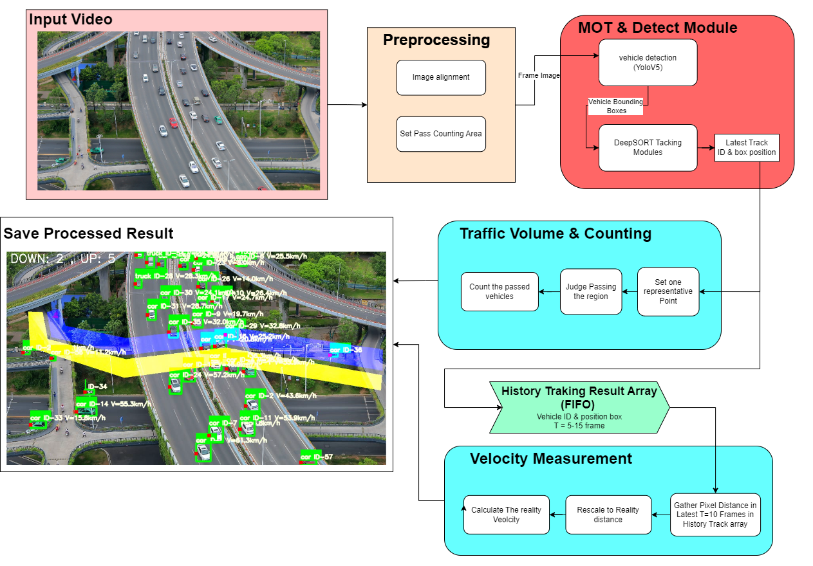

# A simple Traffic Monitoring System Design :bullettrain_front:

Author: LokiXun	rongji.xun@gmail.com


> - survey paper 
>
>   **[A Systematic Review of Drone Based Road Traffic Monitoring System ](https://ieeexplore.ieee.org/abstract/document/9893814/) :+1:**
>
>   This survey is really good and introduce most categories of  image processing, MOT, Object Detection methods which applied in traffic monitoring system. **Maybe a Not Bad material to learn these algorithms with this actual scenario.**
>
>   - traditional methods
>
>     [Moving Vehicle Detection for Automatic Traffic Monitoring.pdf](./docs/traffic_monitoring_system_survey/Moving Vehicle Detection for Automatic Traffic Monitoring.pdf)

## Usage

```
src/main.py  # entry
```

## checkpoints

- YoloV5 pytorch checkpoint

  [Google Drive](https://drive.google.com/file/d/1zOxuRx6OOY16j--RLuZvJp0PxJUtZ7E6/view?usp=drive_link)


## TODO :timer_clock:

- [x] realize the fundamental modules

  - [x] passed vehicle counting

    the region needs to be specified beforehand. 

  - [x] Scene density

    only count the vehicles bounding boxes number in certain frame (only responsible for 1 frame)

  - [x] velocity measurement

    quite raw, because the pixel-to-reality length scale is approximate from the length of one car's bounding box and we assume the car's long is 5m. Also, the video taken have a vanishing point issue, which means the further scale is smaller than the point near the camera.

    Further, the video tested by us was taken on the gantry, which means the view is fixed and have no shaking view's problem.

- [ ] program workflow

  - [x] save the processed result to the offline video file
  - [ ] speed up the whole pipline to make the program run faster and show result in real-time, like split each module and make them running in threads

- [ ] Preprocessing

  - [ ] more accurate scale

  - [ ] change to BEV view

  - [ ] image alignment

  - [ ] train a more robust YoloV5 vehicle detection model

    current used model is pretrained on not-UAV dataset and filter the detection result by using `'car', 'motorcycle', 'bus', 'truck'` labels , which may be inaccurate. And if the view changes a bit, the detection performance is crushed badly! :shit:

    - [ ] light the trained model using `TensorRT, ONNX` or other platforms 


## Background & Needs:rainbow:

Using an moving status drone to take traffics videos, we would like to **extract the vehicles from the video data and calculate each vehicle's instant velocity and detect traffics' volume and vehicles' density**, realizing a simple version of the traffic monitoring system.

- An overall workflow of the program

  


### Traffic Volume :man_factory_worker:

> - [Simultaneously detecting and counting dense vehicles from drone images](https://ieeexplore.ieee.org/abstract/document/8648370)
>
> - [[Urban traffic density estimation based on ultrahigh-resolution UAV video and deep neural network](https://ieeexplore.ieee.org/abstract/document/8536405/)]

Say in Human's way: **(Count vehicles which passed the assigned region in short period)**

We assume the drone would hover around or stay at nearly a unchanged position. And we need to specify the a line-shape target region to denote where a car is passed or not.

For the view in video may shake a little, so we need to deploy some `image-alignment` methods to make the view nearly the same.


### Traffic Density

Count vehicles' number in current frame


### **Velocity Measurement :zap:**

> [Speed estimation of multiple moving objects from a moving UAV platform](https://www.mdpi.com/472466) :+1:

measure vehicles' travel distance in a short frame period, current take $FrameNum \in[2,10]$ frames. And Gather the pixel-level distance in history frames (saved in one array for each ID). And we need to acquire these parameters.

1) pixel's scale (unit=meters/second)

   correspond to what length in reality.  We realize this by assume that the car's length is 5 meters and take one detection bounding box's length(pixel number) as reference to get the rough scale. $scale = 5 m/BoundBoxLen$

2) FPS. 

After all the variables, we could use the below equation to calculate the nearly actual velocity.


$$
VelocityActual = \frac{PixelDistance * Pixel2RealityScale}{FrameNum * 1/FPS}
$$


## Preprocessing

- Unify the lighting condition

- Histogram Equalization

  calculate the accumulated gray-scale probability * 256
  $$
  target~gray~ value = \sum_{i=0}^{x}\frac{L_i}{M*N} * 256
  $$

- Image alignment

  ORB-feature & RANSAC used in [Speed estimation of multiple moving objects from a moving UAV platform](https://www.mdpi.com/472466) :+1:

- BEV view

  > [reference](https://zhuanlan.zhihu.com/p/507722579)


## Code Reference :construction_worker:

- https://github.com/dyh/unbox_yolov5_deepsort_counting.git modified on this one. :laughing:
- https://github.com/Sharpiless/Yolov5-deepsort-inference
- https://github.com/ultralytics/yolov5/
- https://github.com/ZQPei/deep_sort_pytorch
